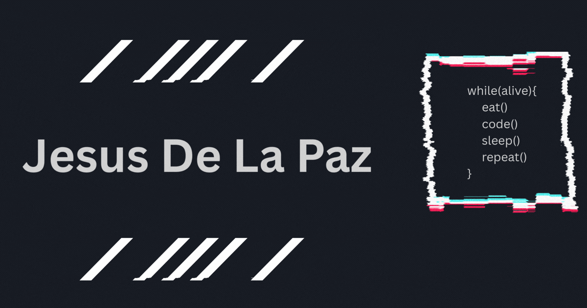

<h1 align="center">👋 Welcome I'm Jesus</h1>

  🚀 Passionate about coding and building cool things. 
  🧠 Always learning something new. 
  🌍 Sharing my projects with the world.

---

<h2 align="center">🛠️ Languages & Tools</h2>

  <!-- Programming Languages -->
  
  
  
  
  
  
  
  
  
  

---

<h2 align="center">🚀 Frameworks & Technologies</h2>

  
  
  
  
  
  
  
  
  

---

<h3>📈 GitHub Stats</h3>

  
  

---
<h2 align="center"> Support My Work</h2>

  

